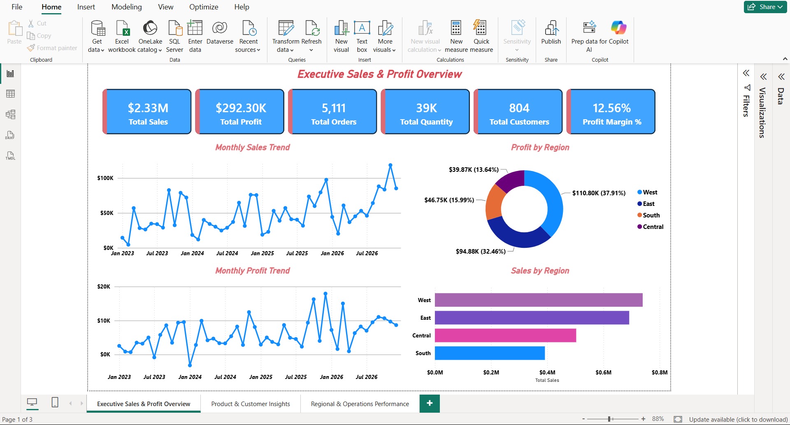
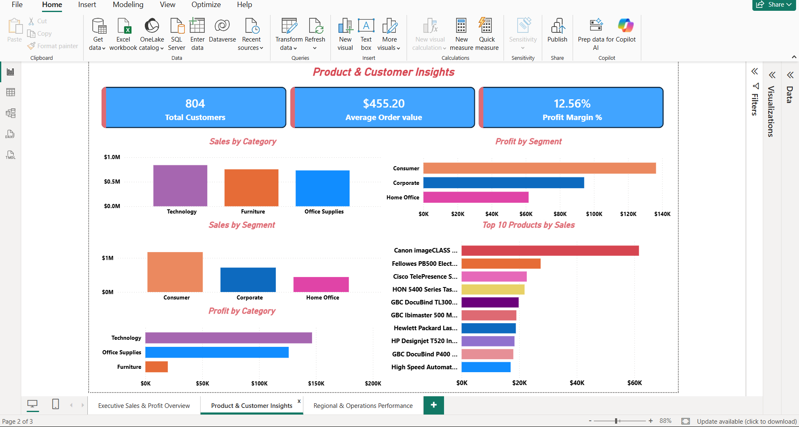
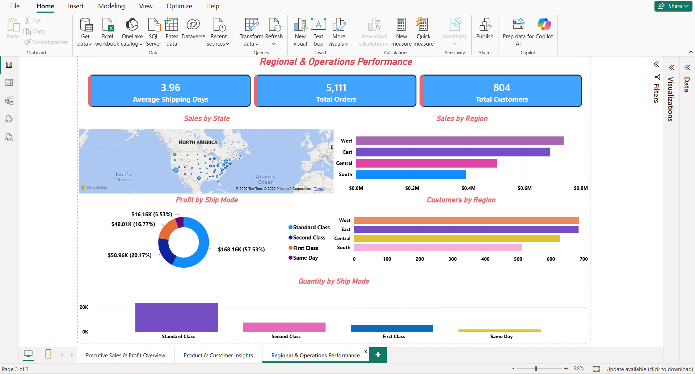

# 📊 Sales Performance Dashboard

An end-to-end personal data analytics project focused on analyzing sales, profitability, customers, products, regions, and shipping performance.

The project follows a complete analytics workflow:

**Raw Data → Data Cleaning → EDA → Time-Series Analysis → SQL Analysis → Data Validation → Power BI → Business Insights**

---

## 📌 Project Overview

The goal of this project was to transform a raw sales dataset into meaningful business insights covering overall sales performance, profitability, customer value, product performance, regional trends, and operational efficiency.

This is a personal portfolio project created to apply multiple data analytics tools together in one end-to-end workflow.

---

## 🎯 Business Problem

Raw transactional sales data does not directly provide a clear understanding of business performance.

This project focuses on questions such as:

- How much sales and profit are being generated?
- Which categories and regions perform best?
- Which products contribute the most to sales and profit?
- Which customers are most valuable?
- How does profitability change over time?
- Are discounts affecting profitability?
- How efficient are different shipping methods?
- Which areas may require business attention?

---

## 🎯 Project Objectives

- Clean and validate the raw sales dataset.
- Perform exploratory data analysis using Python.
- Analyze monthly and quarterly sales and profitability trends.
- Build a structured MySQL database.
- Perform business-oriented SQL analysis.
- Analyze customers, products, categories, and regions.
- Examine shipping performance and delivery times.
- Build interactive Power BI dashboards.
- Create meaningful KPIs and visualizations.
- Convert analytical results into business insights and recommendations.

---

## 🗂️ Dataset

The final dataset contains:

- **10,194 records**
- **5,111 unique orders**
- **804 unique customers**
- **1,862 unique products**
- **3 categories**
- **17 sub-categories**
- **4 regions**
- **48 months of data**

### Time Period

**January 2023 – December 2026**

### Important Fields

The dataset includes:

- Order details
- Order and shipping dates
- Shipping mode
- Customer information
- Customer segment
- Geographic information
- Product information
- Category and sub-category
- Sales
- Quantity
- Discount
- Profit

Additional analytical fields created during the project:

- Year
- Month
- Month Name
- Quarter
- Month Start
- Profit Margin
- Shipping Days

---

## 🛠️ Tools & Technologies

| Tool | Purpose |
|---|---|
| 🐍 Python | Data cleaning, EDA, time-series analysis and validation |
| 🗄️ MySQL | Database creation, data loading and SQL analysis |
| 📊 Power BI | Data modeling, DAX, KPIs and interactive dashboards |
| 📓 Jupyter Notebook | Python analysis environment |
| 🧮 DAX | Power BI measures and calculations |
| 🔧 Git & GitHub | Version control and project portfolio |

### Python Libraries

- Pandas
- NumPy
- Matplotlib
- Statsmodels

---

## 🔄 Project Workflow

```text
Raw Sales Dataset
       ↓
Data Loading & Cleaning
       ↓
Data Validation
       ↓
Exploratory Data Analysis
       ↓
Time-Series Analysis
       ↓
MySQL Database
       ↓
SQL Business Analysis
       ↓
Power BI Data Modeling
       ↓
DAX Measures & KPIs
       ↓
Interactive Dashboards
       ↓
Business Insights & Recommendations
```

---

# 🐍 Python Analysis

### 1. Data Loading & Cleaning

The raw dataset was examined for missing values, duplicates, invalid numerical values, data types, date fields, and sales/quantity/discount/profit consistency.

The final validated dataset contained:

**10,194 rows × 28 columns**

### 2. Exploratory Data Analysis

The analysis explored:

- Sales by category
- Profit by category
- Sales by region
- Profit by region
- Sales by customer segment
- Profit by customer segment
- Monthly sales
- Monthly profit
- Monthly profit margin
- Quarterly profit margin
- Discount versus profit
- Shipping-day distribution

### 3. Time-Series Analysis

Monthly and quarterly trends were analyzed across **48 months**, from January 2023 to December 2026.

The analysis also included a stationarity check using the Augmented Dickey-Fuller test.

### 4. Data Validation

Final validation confirmed:

- **0 missing values**
- **0 complete duplicate rows**
- No invalid sales values
- No invalid quantity values
- No invalid discount values
- No invalid shipping-day values

There were **1,901 records with negative profit**, which were retained and analyzed because they represent loss-making transactions rather than data errors.

---

# 🗄️ MySQL & SQL Analysis

The cleaned dataset was loaded into a MySQL database named:

```text
sales_performance
```

with the main table:

```text
sales_data
```

SQL analysis was organized into scripts covering:

### Database Setup
- Database creation
- Table creation
- Data loading

### Data Quality & Profiling
- Record counts
- Unique orders
- Unique customers
- Unique products
- Missing-value checks
- Duplicate checks
- Invalid-value checks

### Business Analysis
- Sales performance
- Profitability
- Category performance
- Customer analysis
- Product analysis
- Regional analysis

### Time-Series & Operations
- Monthly performance
- Shipping mode analysis
- Delivery-time analysis
- Long-delivery orders

### Final Validation
- KPI validation
- Business-level calculations
- Final consistency checks

---

# 📊 Power BI Dashboard

The final Power BI dashboard contains three main pages.

## 1. Executive Sales & Profit Overview

### KPIs

- Total Sales
- Total Profit
- Total Orders
- Total Quantity
- Total Customers
- Profit Margin %

### Visualizations

- Monthly Sales Trend
- Monthly Profit Trend
- Profit by Region
- Sales by Region

## 2. Product & Customer Insights

### KPIs

- Total Customers
- Average Order Value
- Profit Margin %

### Visualizations

- Sales by Category
- Profit by Category
- Sales by Segment
- Profit by Segment
- Top 10 Products by Sales

## 3. Regional & Operations Performance

### KPIs

- Average Shipping Days
- Total Orders
- Total Customers

### Visualizations

- Sales by State
- Sales by Region
- Profit by Ship Mode
- Customers by Region
- Quantity by Ship Mode

---

# 📈 Key Performance Indicators

| KPI | Result |
|---|---:|
| Total Sales | **$2,326,534.35** |
| Total Profit | **$292,296.81** |
| Total Orders | **5,111** |
| Total Quantity | **38,654** |
| Total Customers | **804** |
| Total Products | **1,862** |
| Average Order Value | **$455.20** |
| Overall Profit Margin | **12.56%** |
| Average Profit per Order | **$57.19** |
| Average Sales per Customer | **$2,893.70** |
| Average Shipping Days | **3.96 days** |

> Overall profit margin is calculated at the business level as **Total Profit ÷ Total Sales**, rather than averaging individual transaction-level margins.

---

# 🔎 Key Findings

### 📅 Monthly Performance

- **November** recorded the highest monthly sales at approximately **$352.67K**.
- **February** recorded the lowest monthly sales at approximately **$59.75K**.
- **December** recorded the highest monthly profit at approximately **$44.23K**.
- **January** recorded the lowest monthly profit at approximately **$9.50K**.

### 💰 Profitability

- Total profit reached approximately **$292.30K**.
- Overall business-level profit margin was **12.56%**.
- Profitability varies across categories, regions and products.
- Negative-profit records were retained and analyzed to identify potential areas of business concern.

### 🚚 Shipping

- Average shipping time was approximately **3.96 days**.
- Shipping times ranged from **0 to 11 days**.
- Orders taking more than **5 days** were separately analyzed to identify longer-delivery cases.

---

# 💡 Business Insights

### 1. Monitor seasonal sales patterns

Sales vary considerably across months, with November showing particularly strong sales performance. Understanding these patterns can help with inventory planning, promotions and resource allocation.

### 2. Focus on profitability, not only revenue

High sales do not necessarily mean high profitability. Comparing sales, profit and profit margin helps identify products and regions that generate sustainable business value.

### 3. Identify loss-making products

Products with negative overall profit can be investigated further for high discounts, pricing issues, product costs, low margins and operational factors.

### 4. Understand customer value

Customer-level analysis helps identify customers contributing significantly to sales and profit, supporting customer retention and prioritization strategies.

### 5. Monitor delivery performance

Shipping analysis helps identify differences between shipping modes and longer-delivery orders. Reducing unnecessary delivery delays can improve operational efficiency and customer experience.

---

# 📁 Project Structure

```text
Sales_Performance_Dashboard/
│
├── DataSet/
│
├── Images/
│   ├── Python_EDA/
│   ├── SQL/
│   └── Workflows/
│
├── PowerBI/
│   └── Sales_Performance_Dashboard.pbix
│
├── Python/
│   ├── 01_Data_Loading_and_Cleaning.ipynb
│   ├── 02_Exploratory_Data_Analysis.ipynb
│   ├── 03_Time_Series_Analysis.ipynb
│   └── 04_Data_Validation.ipynb
│
├── SQL/
│   ├── 01_Database_Setup_and_Load.sql
│   ├── 02_Data_Quality_and_Profiling.sql
│   ├── 03_Sales_Profitability_Customer_Product.sql
│   ├── 04_Time_Series_and_Shipping.sql
│   ├── 05_Business_Insights_and_Final_Validation.sql
│   └── README_SQL.md
│
├── README.md
└── .gitignore
```

---

# 📸 Dashboard Preview


### Executive Sales & Profit Overview



### Product & Customer Insights



### Regional & Operations Performance



---

# 📊 Python EDA Visualizations

Selected Python analysis visuals cover:

- Sales by Category
- Profit by Category
- Sales by Region
- Profit by Region
- Sales by Segment
- Profit by Segment
- Monthly Sales Trend
- Monthly Profit Trend
- Monthly Profit Margin
- Quarterly Profit Margin
- Discount vs Profit
- Shipping Days Distribution

These are available inside:

```text
Images/Python_EDA/
```

---

# 🗄️ SQL Analysis Evidence

Selected SQL analysis outputs are available in:

```text
Images/SQL/
```

They cover:

- Database Structure
- Data Quality Validation
- Sales Analysis
- Profitability Analysis
- Customer Analysis
- Product Analysis
- Regional Analysis
- Shipping Analysis

---

# 📚 What I Learned

This project was more than just building a dashboard. It helped me understand how the different stages of data analytics connect together.

I learned how to:

- Work with a real-world style transactional dataset.
- Clean and validate data before analysis.
- Use Python for exploratory and time-series analysis.
- Use MySQL to store and structure analytical data.
- Write SQL queries to answer business questions.
- Compare sales and profitability from different perspectives.
- Build relationships and measures in Power BI.
- Create DAX measures for business KPIs.
- Design dashboards around business questions rather than simply adding charts.
- Validate results across Python, SQL and Power BI.
- Organize a complete analytics project using Git and GitHub.

Most importantly, I learned that **data analysis is not only about finding numbers — it is about understanding what those numbers mean and communicating them clearly.**

---

# 🌱 How This Project Helped Me Grow

This was an important step in my growth as an aspiring data analyst because it was one of my first projects where I worked through the **complete analytics lifecycle** instead of focusing on only one tool.

Working on the project helped me become more comfortable moving between Python, SQL and Power BI and understanding how each tool contributes to the overall analytical process.

It also taught me the importance of:

**Data Quality → Analysis → Validation → Visualization → Communication**

The project gave me more confidence in taking a dataset from its raw form and turning it into something that can support business decisions.

There is still a lot more I want to learn, but this project gave me a strong foundation to build on.

---

# 🚀 Future Improvements

Some possible future improvements include:

- Adding more advanced customer segmentation.
- Performing deeper product-level profitability analysis.
- Exploring predictive sales forecasting.
- Adding more interactive Power BI features.
- Automating parts of the data refresh and reporting process.

---

# 👨‍💻 Project Type

**Personal Data Analytics Portfolio Project**

Built to practice and demonstrate an end-to-end data analytics workflow using Python, MySQL, SQL and Power BI.

---

## ⭐ Final Note

This project represents my learning journey through data analytics and my effort to connect technical analysis with practical business insights.

**Built with Python • MySQL • SQL • Power BI • GitHub**
